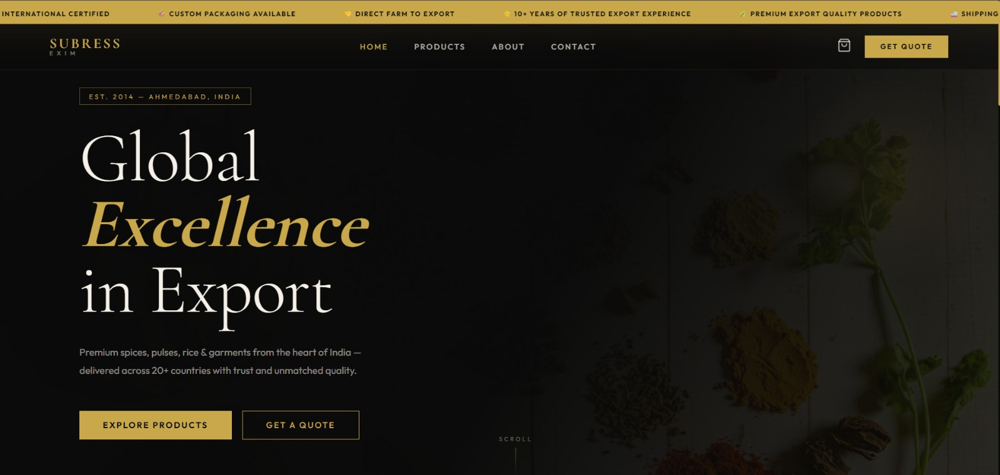
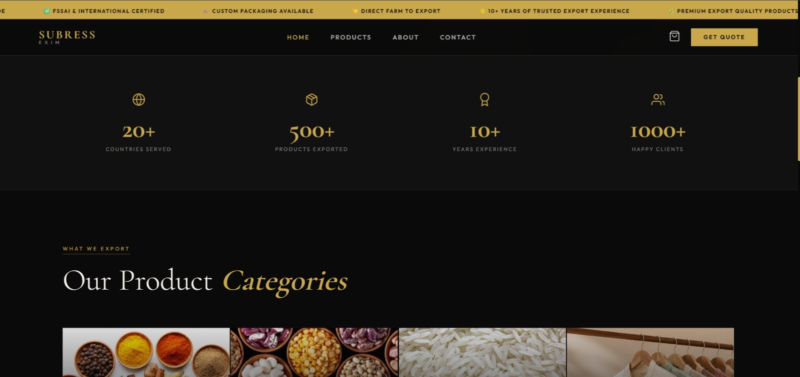
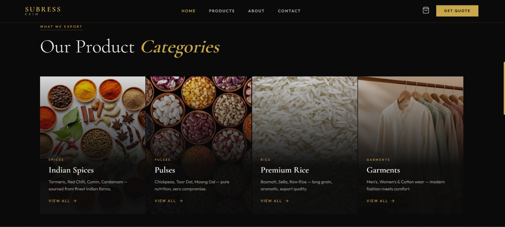
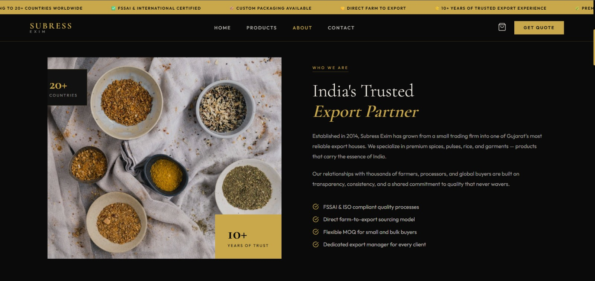
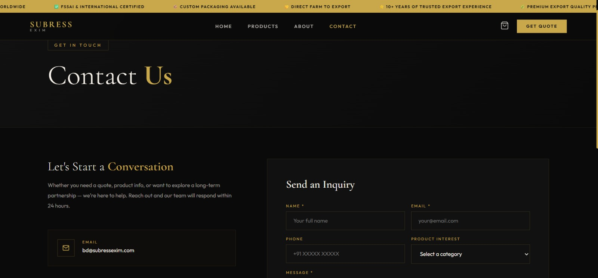

# 🌍 Subress Exim - Import & Export Company Website

A modern and responsive **Import & Export Company Website** built using the **MERN Stack**. This project is designed to provide a professional online presence for an import-export business, allowing visitors to explore the company, its services, products, and easily get in touch through a contact form. The website focuses on delivering a clean user experience with responsive design and smooth navigation.

---

### 🏠 Home Page



---
### Features Section


### Product Categories


### Our Products


### 🏢 About Us



### 📞 Contact



## 🚀 Features

- 🌍 Professional Business Website
- 🏢 Company Introduction
- ℹ️ About Us Section
- 🚢 Services Section
- 📦 Product Showcase
- 📞 Contact Us Page
- 📧 Contact Form with Email Integration
- ✨ Smooth Page Animations
- 📱 Fully Responsive Design
- ⚡ Fast and Optimized User Experience

---

## 🛠️ Tech Stack

### Frontend

- React.js
- React Router DOM
- JavaScript (ES6+)
- HTML5
- CSS3
- Axios
- Framer Motion
- React Hot Toast

### Backend

- Node.js
- Express.js
- MongoDB
- Mongoose
- Nodemailer

---

## 📂 Project Structure

```
Subress-Exim/
│
├── client/
│   ├── public/
│   ├── src/
│   │   ├── assets/
│   │   ├── components/
│   │   ├── pages/
│   │   ├── services/
│   │   ├── App.jsx
│   │   ├── main.jsx
│   │   └── index.css
│
├── server/
│   ├── config/
│   ├── controllers/
│   ├── middleware/
│   ├── models/
│   ├── routes/
│   ├── utils/
│   ├── server.js
│   └── package.json
│
├── README-images/
└── README.md
```

---

## ⚙️ Installation

### Clone the Repository

```bash
git clone https://github.com/your-username/subress-exim.git
```

### Navigate to Project Folder

```bash
cd subress-exim
```

### Install Frontend Dependencies

```bash
cd client
npm install
```

### Install Backend Dependencies

```bash
cd ../server
npm install
```

---

## ▶️ Run the Project

### Start Backend Server

```bash
cd server
npm start
```

### Start Frontend

```bash
cd client
npm run dev
```

The application will run locally on:

```
Frontend : http://localhost:5173
Backend  : http://localhost:5000
```

---

## 🔑 Environment Variables

Create a `.env` file inside the **server** directory and add the following variables:

```env
PORT=5000

MONGO_URI=Your_MongoDB_Connection_String

JWT_SECRET=Your_JWT_Secret

EMAIL=Your_Email_Address

EMAIL_PASSWORD=Your_Email_Password
```

---


---


---

## 🎯 Project Highlights

- Responsive Design
- MERN Stack Architecture
- Professional Business Website
- Contact Form with Email Support
- Smooth Animations
- Fast Navigation
- Reusable React Components
- Clean UI Design
- Mobile Friendly Layout

---

## 📈 Future Improvements

- Product Search
- Product Categories
- Google Maps Integration
- Live Chat Support
- SEO Optimization
- Image Gallery
- Performance Optimization
- Docker Deployment

---

## 🤝 Contributing

Contributions, issues, and feature requests are welcome.

Feel free to fork this repository and submit a pull request.

---

## 👩‍💻 Author

**Simran Kumari**

- GitHub: https://github.com/your-github-username
- LinkedIn: https://linkedin.com/in/your-linkedin-profile

---

## ⭐ Support

If you found this project useful, please consider giving it a ⭐ **Star** on GitHub.

It helps others discover the project and motivates further improvements.

---

### Thank You ❤️